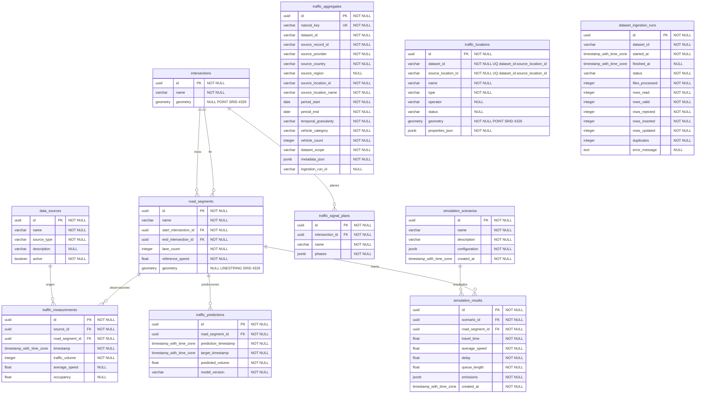

# Modelo relacional

El diagrama representa las once tablas existentes. Las ocho líneas corresponden únicamente a FK reales. La cardinalidad del padre es uno obligatorio por fila hija; un padre puede tener cero o muchas filas hijas. Los identificadores externos de la demostración no se dibujan como FK.

Las tablas traffic_aggregates, traffic_locations y dataset_ingestion_runs aparecen independientes porque las migraciones no declaran FK entre ellas. En traffic_locations la unicidad es conjunta: dataset_id + source_location_id. No se presupone que los puntos externos equivalgan a tramos del corredor.

Fuente: migraciones 0001 y 0002, modelos ORM y modelo relacional aportado por el responsable de BD. El diagrama se conserva como texto editable y GitHub lo renderiza en Markdown.

[Diccionario completo](data-dictionary.md) · [Integridad e índices](physical-model.md)
