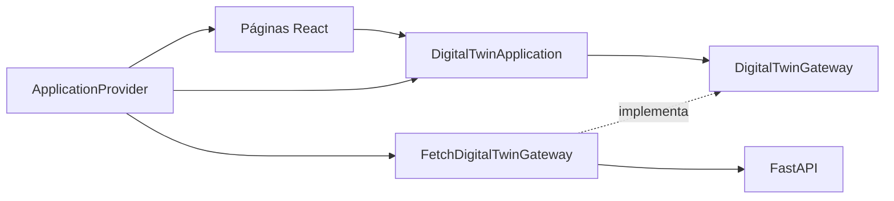

# Arquitectura del frontend

## Decisión

Se adopta arquitectura hexagonal orientada a funcionalidades. Es la alternativa más pertinente porque la consigna exige separación entre dominio, aplicación e infraestructura, y el frontend necesita consumir varios endpoints sin acoplar las reglas de interacción a React o a `fetch`.

No se eligió una arquitectura basada únicamente en carpetas por componentes porque no protege las dependencias. Tampoco se replicó la estructura completa del backend: en el navegador se conserva un único puerto de salida y casos de uso compactos, proporcionales al tamaño del PMV.

## Capas y responsabilidades

| Capa | Responsabilidad | Dependencias permitidas |
|---|---|---|
| Dominio | Modelos, comandos y contrato del gateway | Ninguna capa interna |
| Aplicación | Orquestación y validaciones de los casos de uso | Dominio |
| Infraestructura | Traducción entre el puerto y la API REST | Dominio |
| Presentación | Estado de interfaz, formularios, navegación y renderizado | Aplicación y dominio |

La flecha hacia el puerto expresa inversión de dependencias: aplicación define lo que necesita y el adaptador HTTP implementa ese contrato.

## Casos de uso

- `loadDashboard`: reúne salud, estado del gemelo, catálogo y replay.
- `queryTraffic`: valida filtros y consulta la serie normalizada.
- `startReplay`, `pauseReplay`, `continueReplay`, `stopReplay`, `resetReplay`: controlan la demostración histórica.
- `getMlExperiment` y `predictTraffic`: separan el benchmark publicado de una inferencia local.
- `createAndRunScenario`: registra y ejecuta un escenario en una sola intención de usuario.

## Trazabilidad con la consigna

| Requisito | Evidencia en el frontend |
|---|---|
| Frontend funcional | Rutas de dashboard, demo, predicción, escenarios, fuentes y estado |
| Consumo de API | Adaptador `FetchDigitalTwinGateway` |
| Estructura de carpetas | Capas `domain`, `application`, `infrastructure`, `presentation` |
| Arquitectura hexagonal | Puerto definido en dominio e implementación en infraestructura |
| Historias de usuario | Tabla de trazabilidad en `frontend/README.md` |
| Integración end-to-end | Consultas, replay, predicción y escenarios conectados a FastAPI |
| Pruebas básicas | Type-check estricto y compilación de producción mediante los scripts de npm |

## Reglas de evolución

1. Las páginas no deben usar `fetch` directamente.
2. Las respuestas HTTP se tipan como modelos del dominio en el adaptador.
3. Las validaciones de intención pertenecen a aplicación, no a componentes.
4. Las limitaciones del backend deben mostrarse; no se reemplazan por datos inventados.
5. Un nuevo proveedor de datos implementa el puerto sin modificar los casos de uso.
